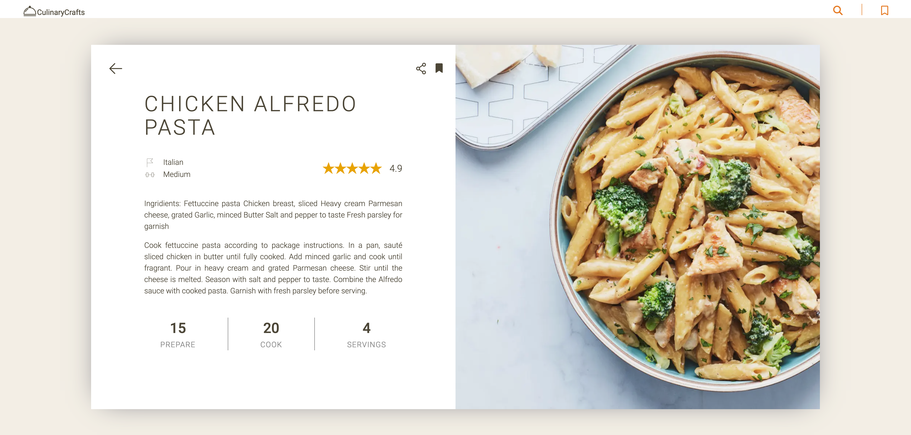
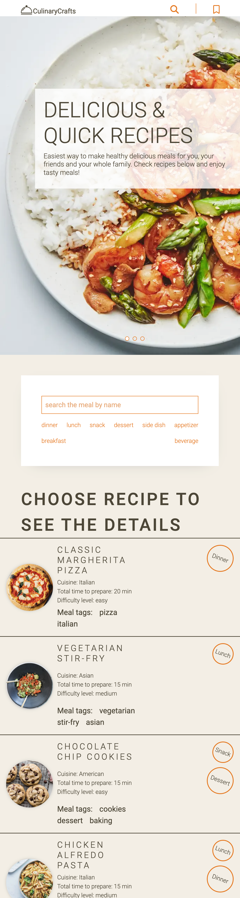
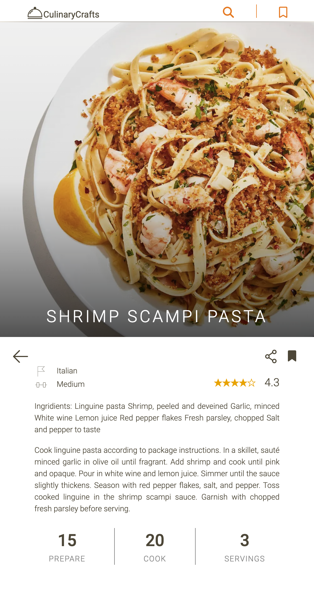

# RecipesApp

CulinaryCraft is a responsive web application built with Angular, enabling easy browsing, searching, and saving of recipes. The recipes are fetched from an API. Users can navigate through the recipe list with pagination, learn more about each dish, and filter results by category or meal name. The 'Save' feature allows users to store their favorite recipes for later access through cookies.

Tech stack: 

- Angular
- TypeScript
- RxJS
- Bootstrap
- REST API
- HTML, SCSS

## Live

[Exchange-rate-app](https://)

## Some screenshots:

    
        

